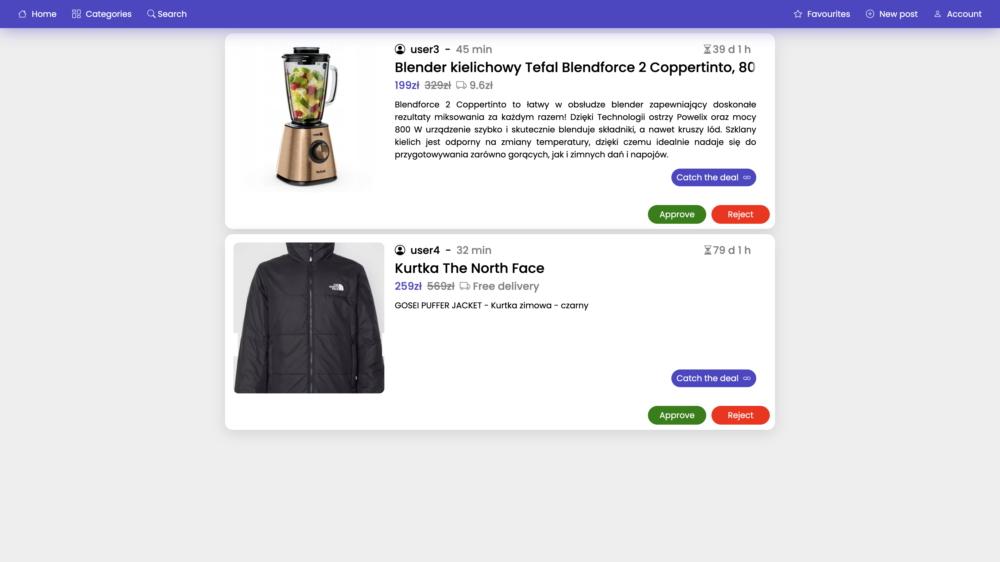

# Web Bargain Portal

## Overview

The Web Bargain Portal project aims to create an online platform where users can discover and take advantage of various bargains, discounts, and deals offered by different retailers. This portal will serve as a central hub for users to browse through a wide range of products and services available at discounted prices, ultimately helping them save money on their purchases.

## Table of Contents

1. [Features](#features)
2. [Technology Stack](#technology-stack)
3. [Database Design and Structure](#database-design-and-structure)
4. [Design patterns](#design-patterns)
5. [Installation](#installation)
6. [Usage](#usage)
7. [Contributing](#contributing)
8. [License](#license)

## Features

1. **User Registration and Authentication**
   - Users can create accounts and log in securely.
   - Authentication mechanisms ensure user data security.
2. **Bargain Listings**
   - Display a wide range of products available at discounted prices.
   - Organize products into categories for easy navigation.
   - Provide detailed descriptions and images for each product.
3. **Search and Filter**
   - Implement search functionality to allow users to find specific products.
4. **Likes and Favourites**
   - Allow users to rate and save bargain in favourites.
   - Display all ratings to help users make informed decisions.
5. **Responsive Design:**
   - Application is fully responsive, making it easy to navigate on various devices.
6. **Admin Panel**
   - Allow administrators to accept or reject posts.

## Technology Stack

- **Frontend:** HTML, CSS, JavaScript
- **Backend:** PHP
- **Database:** PostgreSQL, pgAdmin
- **Server:** Nginx
- **Deployment:** Docker

## Database Design and Structure

The project includes a comprehensive design and structure for the database, ensuring efficient data storage and retrieval. Here are the key components:

1. **Entity-Relationship Diagram (ERD):**
   - The `data-structure.png` file in the database directory provides a visual representation of the database schema.
   - [View ERD](./database/data-structure.png)

2. **Database Schema:**
   - The `create-structure.sql` file contains the SQL commands to create the database structure. It defines tables, relationships, and other database elements.
   - [View Database Script](./database/create-structure.sql)

3. **Triggers:**
   - The `triggers` subfolder contains SQL scripts defining triggers, which are database objects that automatically perform actions in response to certain events, such as INSERT, UPDATE, or DELETE operations on specific tables.

4. **Procedures and Functions:**
   - The `procedures` and `functions` subfolders contain SQL scripts defining stored procedures and functions, respectively. These database objects encapsulate reusable logic that can be executed within the database environment.

5. **Initialize Data Script:**
   - The `initialize-data.sql` script initializes the database with basic data required to bootstrap the project. This may include inserting default user accounts, product categories, or any other essential data to kickstart the application.

## Design patterns

1. **MVC (Model-View-Controller)**
   - Separates the application into Model, View, and Controller components.
2. **Repository**
   - Abstracts the data layer, providing a modular structure.
3. ***Singleton*** 
   - Ensures a class has only one instance and provides a global point of access to it.

## Installation
The project is dockerized for easy setup and deployment. Follow these steps to get the project up and running:
1. **Clone the Repository**
   - `git clone git@github.com:tomasz-umanski/Web-Bargain-Portal.git`
2. **Navigate to the Project Directory**
3. **Docker Setup:** 
   - Ensure Docker and Docker Compose are installed on your system. In the project directory in the docker folder, you'll find Docker configuration files.
4. **Build and start Docker Containers:**
   - `docker-compose up -d`
5. **Initialize Database:**
   - **Connect to PostgreSQL Database:**
      - Open pgAdmin tool.
      - Navigate to the "Servers" section and select the PostgreSQL server you want to connect to.
      - Enter the provided credentials (username, password, host, port) to establish the connection.
   - **Initialize Database Structure:**
      - Locate the `create-structure.sql` script in your project directory.
      - Right-click on your connected database in pgAdmin.
      - Select "Query Tool" to open a new SQL query window.
      - Copy the contents of `create-structure.sql` and paste them into the query window.
      - Execute the script by clicking the "Execute" button or pressing `F5`.
   - **Initialize Procedures, Functions, and Triggers:**
      - Navigate to the respective folders containing the SQL scripts for procedures, functions, and triggers.
      - Open each script in pgAdmin's query tool.
      - Execute each script to create the stored procedures, functions, and triggers in the database.
   - **Run `initialize-data.sql` Script:**
      - Locate the `initialize-data.sql` script in your project directory.
      - Open the script in pgAdmin's query tool.
      - Execute the script to initialize the database with the required initial data.
6. **Access the Application:**
   - After the containers are up and running, you can access the application through your web browser.

## Usage
### Home Page
The homepage serves as a platform for users to explore and engage with posts, offering them the flexibility to sort based on their preferences. A navigation bar complements the browsing experience, providing convenient access to key functionalities of the site. Users can effortlessly filter posts by categories, conduct searches using specific queries, peruse their favorited posts, or contribute to the community by adding new content. Additionally, they can seamlessly access features such as logging in or registering via the navigation bar, ensuring a smooth and user-friendly experience throughout their journey on the site.
Desktop | Mobile
:-------------------------:|:-------------------------:
  |  

### Sign In Page
The login page serves as a gateway for users to access personalized features and content on the site. It provides a secure and streamlined entry point, facilitating user authentication with ease.
Desktop | Mobile
:-------------------------:|:-------------------------:
 | 

### Sign Up Page
The registration page acts as a pivotal step for users to join the community and unlock a plethora of personalized features and benefits. It offers a user-friendly interface where individuals can securely create their accounts, providing essential details to establish their presence on the platform.
Desktop | Mobile
:-------------------------:|:-------------------------:
 | 

### New Post Page
The new post page empowers users to contribute to the platform's vibrant community by sharing their content and experiences. It offers an intuitive interface where users can effortlessly create and publish their posts, enriching the site's content ecosystem. The page features a user-friendly form that guides individuals through the process of crafting their posts, allowing them to input essential details such as titles, descriptions, images, and other pertinent information. Additionally, the navigation bar remains readily accessible, providing convenient links to key functionalities for seamless navigation and exploration.
Desktop | Mobile
:-------------------------:|:-------------------------:
 | 

### Posts for Admin Approval Page
This page serves as a vital hub only for administrators to oversee and manage the content shared on the platform. It provides administrators with a centralized interface where they can review and approve posts submitted by users before they are published to the wider community. The page features a comprehensive overview of pending posts, allowing administrators to assess each submission thoroughly.
Desktop | Mobile
:-------------------------:|:-------------------------:
 | 

## Contributing
If you're interested in contributing to the project, you can:
   - Fork the repository on GitHub.
   - Make your desired changes or additions.
   - Submit a pull request with your changes for review by the project maintainers.
   - Participate in discussions and collaborate with other contributors to improve the project.

## License

This project is licensed under the MIT License